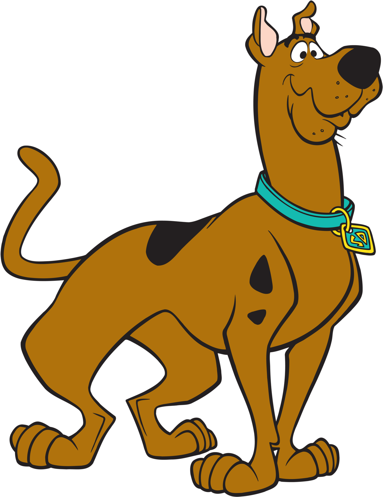

---
title: "Scooby-Doo - Final Dashboard"
output: 
  flexdashboard::flex_dashboard:
    orientation: columns
    vertical_layout: fill
    source_code: embed
    social: menu

runtime: shiny
---

```{r global, include=FALSE}
# load data in 'global' chunk so it can be shared by all users of the dashboard
library(flexdashboard)
library(tidyverse)
library(plotly)
library(knitr)
library(DT)
library(lubridate)
df <- read_csv('ScoobyDoo.csv')
df$imdb <- as.numeric(df$imdb)
monster_gender <- unique(df$mainMonsterGender)
format2 <- unique(df$format)
network2 <- unique(df$network)
df$date <- mdy(df$dateAired)

df$engagement <- as.numeric(df$engagement)
df$culprit.amount <- as.numeric(df$culprit.amount)
df$monster.amount <- as.numeric(df$monster.amount)
df$split.up <- as.integer(df$split.up)
```

{.sidebar}
=======================================================================

Use the following for the "Plots" tab:

```{r}
sliderInput(inputId = "imdb_input",
            label = h3("IMDB Rating Range"),
            min = min(df$imdb, na.rm=TRUE),
            max = max(df$imdb, na.rm=TRUE),
            value= c(4.6, 9.6))

selectInput(inputId = "sex_input", 
            label = h3("Gender of Monster"),
            choices = monster_gender, 
            selected = 'Male')

radioButtons(inputId = "format_input", 
                   label = h2("Media Format"),
                   choices = format2, 
                   inline = TRUE,
                   selected = 'TV Series')

checkboxGroupInput(inputId = "network_input", 
             label = h3("Select Network"),
             choices = network2,
             inline = TRUE,
             selected = 'CBS')

dateRangeInput(inputId = "date_input", 
               label = h2("Date range"), 
               start = min(df$date), 
               end = max(df$date),
               min = min(df$date), 
               max = max(df$date))
```

Searchable Data Table
=======================================================================

```{r}
datatable(df, options = list(
  pageLength = 25
))
```

Plots
=======================================================================

Column {data-width=500, .tabset}
-----------------------------------------------------------------------

### Plot 1

```{r}
renderPlotly({
  p1 <- df %>% 
    filter(imdb>input$imdb_input[1], imdb<input$imdb_input[2]) %>% 
    filter(mainMonsterGender==input$sex_input) %>% 
    filter(format %in% input$format_input) %>%
    filter(network==input$network_input) %>%
    filter(date > input$date_input[1], date < input$date_input[2]) %>%
    ggplot(aes(x=run.time, color=motive))+
    geom_density()
  ggplotly(p1)
})
```


### Plot 2

```{r}
renderPlotly({
  p2 <- df %>% 
    filter(imdb>input$imdb_input[1], imdb<input$imdb_input[2]) %>% 
    filter(mainMonsterGender==input$sex_input) %>% 
    filter(format %in% input$format_input) %>%
    filter(network==input$network_input) %>%
    filter(date > input$date_input[1], date < input$date_input[2]) %>%
    ggplot(aes(x=settingTerrain, fill=caught.scooby))+
    geom_bar()
  ggplotly(p2)
})
```

### Plot 3

```{r}
renderPlotly({
  p3 <- df %>% 
    filter(imdb>input$imdb_input[1], imdb<input$imdb_input[2]) %>% 
    filter(mainMonsterGender==input$sex_input) %>% 
    filter(format %in% input$format_input) %>%
    filter(network==input$network_input) %>%
    filter(date > input$date_input[1], date < input$date_input[2]) %>%
    ggplot(aes(x=index, y=monster.amount, color = split.up))+
    geom_point()
  ggplotly(p3)
})
```


### Plot 4

```{r}
renderPlotly({
  p4 <- df %>% 
    filter(imdb>input$imdb_input[1], imdb<input$imdb_input[2]) %>% 
    filter(mainMonsterGender==input$sex_input) %>% 
    filter(format %in% input$format_input) %>%
    filter(network==input$network_input) %>%
    filter(date > input$date_input[1], date < input$date_input[2]) %>%
    ggplot(aes(x=engagement))+
    geom_histogram()
  ggplotly(p4)
})
```


### Plot 5

```{r}
renderPlotly({
  p5 <- df %>% 
    filter(imdb>input$imdb_input[1], imdb<input$imdb_input[2]) %>% 
    filter(mainMonsterGender==input$sex_input) %>% 
    filter(format %in% input$format_input) %>%
    filter(network==input$network_input) %>%
    filter(date > input$date_input[1], date < input$date_input[2]) %>%
    ggplot(aes(x=index, y=engagement))+
    geom_point()+
    facet_wrap(~seriesName)
  ggplotly(p5)
})
```


Text and Image
=======================================================================

Column {data-width=500}
-----------------------------------------------------------------------

Conclusions and lessons from project:

- Most problems came with the dataset and use of different variables.

- Making sure the variables are formatted properly with correct class and values. Many issues with this, caused some 

- Not as many issues formatting dashboard as originally anticipated.

- Upload as you go, do not try all at once. Even if this means having over 20 separate uploads. This way, you also get to see what works and what doesn't.

About the Dataset:

"Every Scooby-Doo episode and movie's various variables. Took ~1 year to watch every Scooby-Doo iteration and track every variable. Many values are subjective by nature of watching but [uploader] tried [their] hardest to keep the data collection consistent." This dataset was found on Kaggle, and stated that it was open/free to use for educational purposes.

Column {data-width=500}
-----------------------------------------------------------------------

{width=80%}
